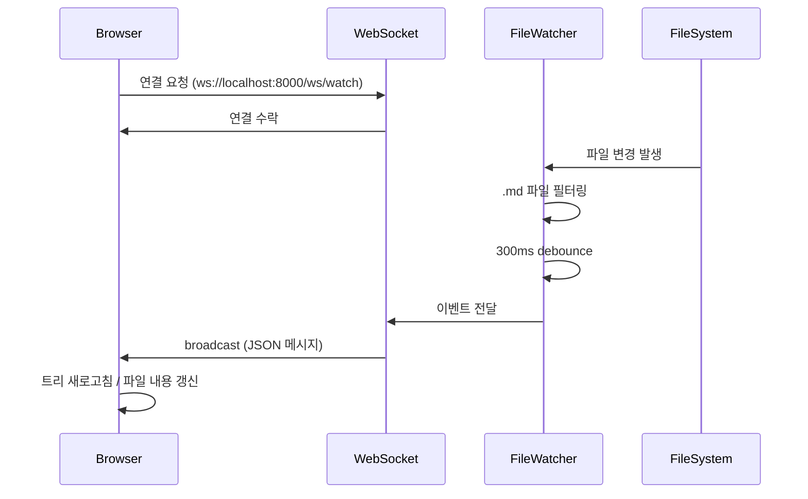

# 파일 변경 감지 WebSocket 스펙

## 1. 개요
- **목적:** 등록된 폴더 내 `.md` 파일 변경을 실시간으로 프론트엔드에 전달
- **담당:** Both (Backend WebSocket + Frontend 연동)
- **상태:** 대기

---

## 2. 연관 자료
- PRD: [PRD.md](../PRD.md) - 섹션 4.4, 7.6
- 코드 점검: [REVIEW.md](../REVIEW.md)
- 관련 API:
  - [folder-register.md](./folder-register.md) - 폴더 등록 시 watcher 추가
  - [folder-delete.md](./folder-delete.md) - 폴더 삭제 시 watcher 제거
- 관련 컴포넌트: [Sidebar.md](../components/Sidebar.md) - 트리 새로고침

---

## 3. 요구사항

### 핵심 기능
1. 등록된 폴더 내 `.md` 파일 변경 실시간 감지
2. 변경 이벤트를 연결된 모든 클라이언트에 broadcast
3. 폴더 등록/삭제 시 watcher 자동 추가/제거
4. 서버 시작 시 기존 등록 폴더 전체 자동 감시

### 감시 대상
- **포함:** `.md` 파일만
- **제외:** 
  - 숨김 파일 (`.`으로 시작)
  - 숨김 폴더 (`.git`, `.vscode` 등) 내 파일
  - 시스템/빌드 폴더: `node_modules`, `__pycache__`, `venv`, `dist`, `build`, `coverage` 등 (성능 최적화)

### 성능 요구사항
- **Debounce:** 300ms (동일 파일 중복 이벤트 방지)
- **감시 모드:**
  - **Docker:** PollingObserver (환경변수 `WATCHDOG_USE_POLLING=true`)
  - **Local:** Native Observer (kqueue/FSEvents) - 성능 최적화

### 연결 관리
- **재연결:** 프론트엔드에서 자동 재연결 (3초 후, 최대 5회)
- **인증:** 없음 (로컬 전용 서비스)

### 시퀀스 다이어그램



---

## 4. WebSocket 명세

### Endpoint
- **Protocol:** WebSocket
- **Path:** `ws://localhost:8000/ws/watch`
- **인증:** None

### 연결 시 동작
1. ConnectionManager에 클라이언트 등록
2. 현재 감시 중인 폴더 수 로깅

### 연결 해제 시 동작
1. ConnectionManager에서 클라이언트 제거

### 서버 → 클라이언트 메시지

#### 파일 변경 이벤트
```json
{
  "type": "file_change",
  "event": "created" | "modified" | "deleted",
  "path": "/data/projectA/spec/api/new-file.md",
  "folder_id": 1
}
```

| 필드 | 타입 | 설명 |
|------|------|------|
| type | string | 메시지 유형 (항상 `"file_change"`) |
| event | string | 이벤트 종류: `created`, `modified`, `deleted` |
| path | string | 변경된 파일의 전체 경로 |
| folder_id | int | 해당 파일이 속한 등록 폴더 ID |

#### 이벤트 종류
| event | 설명 | 프론트엔드 처리 |
|-------|------|-----------------|
| `created` | 새 `.md` 파일 생성 | 해당 folder_id 트리 새로고침 |
| `modified` | `.md` 파일 내용 변경 | 현재 열린 파일이면 내용 새로고침 |
| `deleted` | `.md` 파일 삭제 | 해당 folder_id 트리 새로고침 |

### 클라이언트 → 서버 메시지
- 없음 (서버에서 클라이언트로 단방향 push)

### 연결 상태 메시지 (선택)
```json
{
  "type": "connected",
  "watching_folders": 3
}
```

---

## 5. 비즈니스 로직

### 5.1 서버 시작 시
```
1. DB에서 등록된 폴더 목록 조회
2. 각 폴더에 대해 FileWatcher 생성
3. watchdog Observer 시작 (별도 스레드)
```

### 5.2 폴더 등록 시 (POST /api/folders)
```
1. 기존 폴더 등록 로직 수행
2. 새 폴더에 대한 watcher 추가
3. 연결된 클라이언트에 알림 (선택)
```

### 5.3 폴더 삭제 시 (DELETE /api/folders/{id})
```
1. 해당 폴더 watcher 중지 및 제거
2. 기존 폴더 삭제 로직 수행
```

### 5.4 파일 변경 감지 시
```
1. watchdog 이벤트 수신
2. .md 파일 여부 확인 (아니면 무시)
3. 숨김 파일/폴더 여부 확인 (맞으면 무시)
4. 300ms debounce 적용
5. folder_id 매핑
6. 연결된 모든 클라이언트에 broadcast
```

---

## 6. 엣지 케이스
- [ ] 등록된 폴더가 0개일 때 WebSocket 연결 → 정상 연결, 이벤트 없음
- [ ] 감시 중인 폴더가 외부에서 삭제됨 → 에러 로깅, watcher 정리
- [ ] 동시에 여러 파일 변경 (git checkout 등) → 각각 이벤트 발생 (debounce 개별 적용)
- [ ] 파일 이름 변경 (rename) → `deleted` + `created` 이벤트
- [ ] 대용량 폴더 (1000개+ 파일) → PollingObserver 성능 고려
- [ ] WebSocket 연결 없이 서버만 실행 → watcher는 정상 동작, broadcast 스킵

---

## 7. 테스트 케이스 (TDD - 필수 구현)

> 코딩 에이전트는 아래 테스트 케이스를 **반드시** 구현해야 합니다.
> 테스트 코드 작성 후 구현 코드를 작성하십시오.

### Unit Tests
| 테스트명 | 입력 | 기대 결과 |
|----------|------|-----------|
| `test_is_markdown_file` | `"test.md"`, `"test.txt"` | `True`, `False` |
| `test_is_hidden_file` | `".hidden.md"`, `"normal.md"` | `True`, `False` |
| `test_is_in_hidden_folder` | `"/.git/config.md"`, `"/api/auth.md"` | `True`, `False` |
| `test_debounce_duplicate_events` | 동일 파일 100ms 간격 이벤트 2회 | 이벤트 1회만 발생 |
| `test_debounce_different_files` | 다른 파일 100ms 간격 이벤트 2회 | 이벤트 2회 발생 |

### Integration Tests (WebSocket)
| 테스트명 | 시나리오 | 기대 결과 |
|----------|----------|-----------|
| `test_websocket_connect` | WebSocket 연결 | 101 Switching Protocols |
| `test_websocket_receive_created_event` | 연결 후 `.md` 파일 생성 | `{"type": "file_change", "event": "created", ...}` 수신 |
| `test_websocket_receive_modified_event` | 연결 후 `.md` 파일 수정 | `{"type": "file_change", "event": "modified", ...}` 수신 |
| `test_websocket_receive_deleted_event` | 연결 후 `.md` 파일 삭제 | `{"type": "file_change", "event": "deleted", ...}` 수신 |
| `test_websocket_ignore_non_markdown` | 연결 후 `.txt` 파일 생성 | 이벤트 수신 없음 |
| `test_websocket_ignore_hidden_file` | 연결 후 `.hidden.md` 생성 | 이벤트 수신 없음 |
| `test_websocket_broadcast_multiple_clients` | 클라이언트 2개 연결 후 파일 변경 | 둘 다 이벤트 수신 |

### Edge Case Tests
| 테스트명 | 상황 | 기대 결과 |
|----------|------|-----------|
| `test_no_registered_folders` | 등록 폴더 0개, WebSocket 연결 | 정상 연결, 이벤트 없음 |
| `test_folder_deleted_externally` | 감시 중 폴더 외부 삭제 | 에러 로깅, 크래시 없음 |
| `test_file_rename` | 파일 이름 변경 | `deleted` + `created` 이벤트 |

---

## 8. 참고 (이해를 돕기 위한 의사코드)

### ConnectionManager
```python
class ConnectionManager:
    def __init__(self):
        self.active_connections: list[WebSocket] = []

    async def connect(self, websocket):
        await websocket.accept()
        self.active_connections.append(websocket)

    def disconnect(self, websocket):
        self.active_connections.remove(websocket)

    async def broadcast(self, message: dict):
        for connection in self.active_connections:
            await connection.send_json(message)
```

### FileWatcher (watchdog 연동)
```python
class MarkdownEventHandler(FileSystemEventHandler):
    def __init__(self, folder_id, callback):
        self.folder_id = folder_id
        self.callback = callback
        self.debounce_cache = {}

    def on_any_event(self, event):
        if not event.src_path.endswith('.md'):
            return
        if is_hidden(event.src_path):
            return

        # debounce 처리
        if should_debounce(event.src_path):
            return

        self.callback({
            "type": "file_change",
            "event": event.event_type,
            "path": event.src_path,
            "folder_id": self.folder_id
        })
```

### WebSocket Endpoint
```python
@app.websocket("/ws/watch")
async def websocket_endpoint(websocket: WebSocket):
    await manager.connect(websocket)
    try:
        while True:
            await websocket.receive_text()  # keep alive
    except WebSocketDisconnect:
        manager.disconnect(websocket)
```

---

## 9. 활용 가이드 & 참조 (Next Steps)

### Backend
- `app/api/websocket.py` - WebSocket 엔드포인트
- `app/services/file_watcher.py` - watchdog 연동 서비스
- `app/services/connection_manager.py` - WebSocket 연결 관리

### Frontend
- WebSocket 연결 훅 구현 (`useFileWatcher` 또는 유사)
- 자동 재연결 로직 (3초 후, 최대 5회)
- 이벤트 수신 시 처리:
  - `created` / `deleted` → 해당 folder_id 트리 새로고침
  - `modified` → 현재 열린 파일이면 내용 새로고침

### 의존성 추가
```
# backend/requirements.txt
watchdog>=3.0.0
```

### 후속 작업
- [ ] 프론트엔드 수동 새로고침 버튼 (fallback)

---

## 10. 보안 고려사항 (Security Considerations)

- **Path 노출:** 클라이언트에 전달되는 `path`는 등록된 폴더 내부 경로만 포함 (시스템 경로 노출 최소화)
- **DoS 방지:** debounce로 과도한 이벤트 발생 방지
- **접근 제어:** 로컬 호스트 전용 (CORS 설정으로 외부 접근 차단)
- **심볼릭 링크:** watchdog 기본 동작 유지 (symlink는 따라가지 않음)
